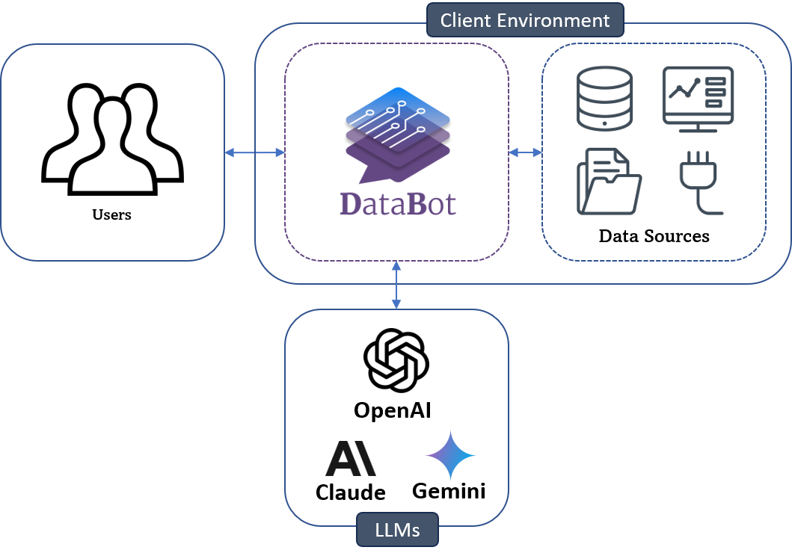

# DataBot
- With <a href="https://intellimenta.com/products/databot/" target="_blank">DataBot</a> you can **explore/visualize/analyze/forecast** your data in your **native language**.
- It's **self-hosted** and **free** for personal use.
- Trying out DataBot is super easy and takes just a few minutes. Instructions <a href="https://databot.intellimenta.com/admin_guide/getting_started/" target="_blank">here</a>.

  

## Features
- 🔍 Data Exploration
- 📊 Data Visualization
- 📝 Report Generation
- 📈 Forecasting
- 🔗 Integration with BI Tools
- 🌐 Multi-language Support
- 🎤 Voice Transcription
- 🗄️ Supporting Major SQL and NoSQL Databases
- 🧩 JSON Columns Support
- 💻 Easy Embedding in Your Website or App
- 📦 Standalone and Containerized Deployment
- 🛡️ Fine-grained Access Control
- 👥 Role-Based Access Control (RBAC)
- 🏢 Multi-Tenant Support
- 🔑 Single Sign-On (SSO)
- 🎨 White-Labelling