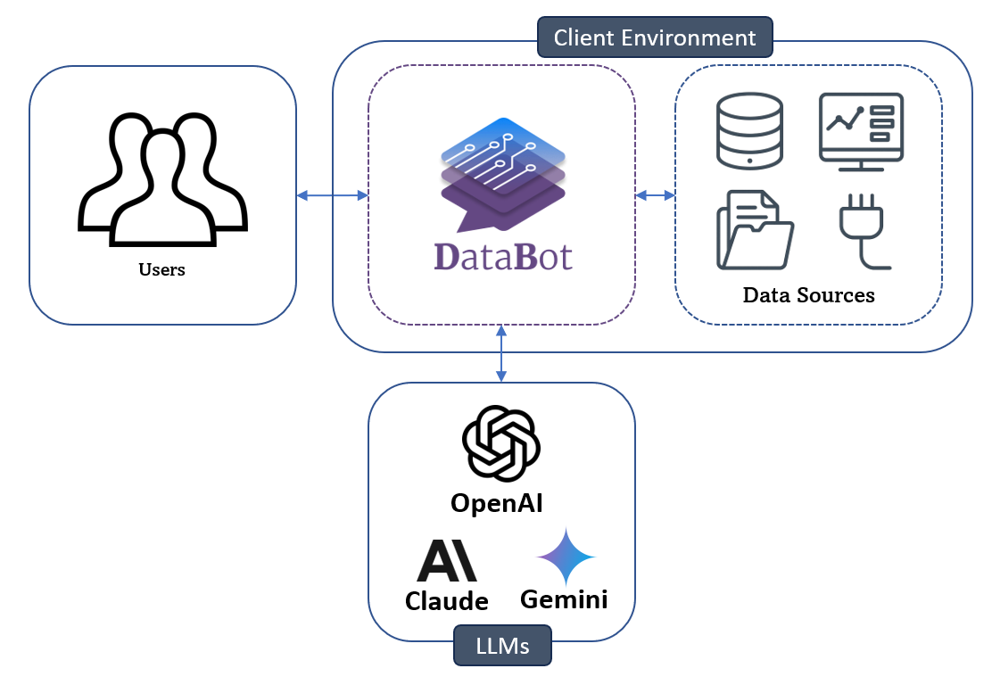
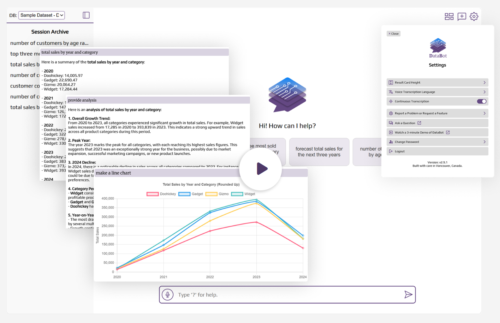

# **DataBot** – Effortless Self-Service Analytics
- With <a href="https://intellimenta.com/products/databot" target="_blank">DataBot</a>, you can **explore**, **visualize**, **analyze**, and **forecast** your data in your **native language**.
- It's **self-hosted** and **free** for personal use.
- Trying out DataBot is very easy and takes just a few minutes. Follow the instructions <a href="https://databot.intellimenta.com/admin_guide/getting_started" target="_blank">here</a>.

  

## Features
- 🔍 Data Exploration
- 📊 Data Visualization
- 📝 Report Generation
- 📈 Forecasting
- 🔗 Integration with BI Tools
- 🌐 Multi-language Support
- 🎤 Voice Transcription
- 🗄️ Supporting Major SQL and NoSQL Databases
- 🧩 JSON Columns Support
- 💻 Easy Embedding in Your Website or App
- 📦 Standalone and Containerized Deployment
- 🛡️ Fine-grained Access Control
- 🙈 Data Obfuscation (Using Dynamic Data Masking)
- 👥 Role-Based Access Control (RBAC)
- 🏢 Multi-Tenant Support
- 🔑 Single Sign-On (SSO)
- 🎨 White-Labelling

## Data Sources
- Major SQL and NoSQL Databases
- Dashboards (via Integration with BI Tools)
- Unstructured files (PDF, Word, TXT, ...) [Coming Soon]
- Structured files (CSV, Excel, ...) [Coming Soon]
- Custom Connectors (Google Sheets, AWS CloudWatch Logs, AirTable, ...) [Coming Soon]

## Watch DataBot in Action

