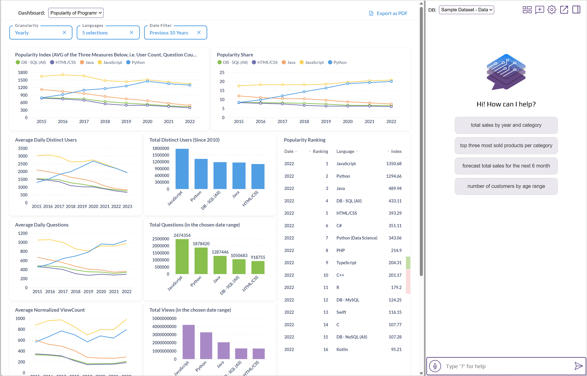
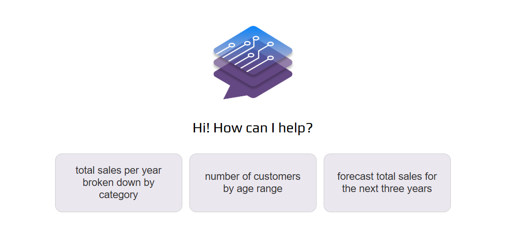
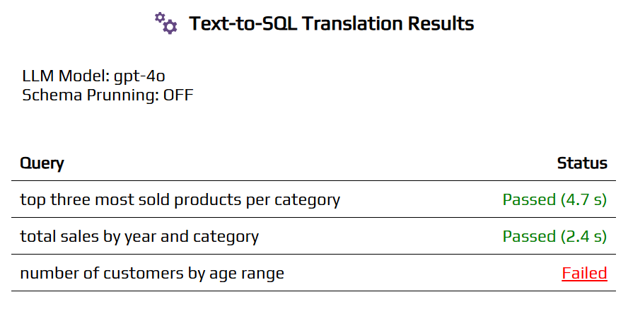
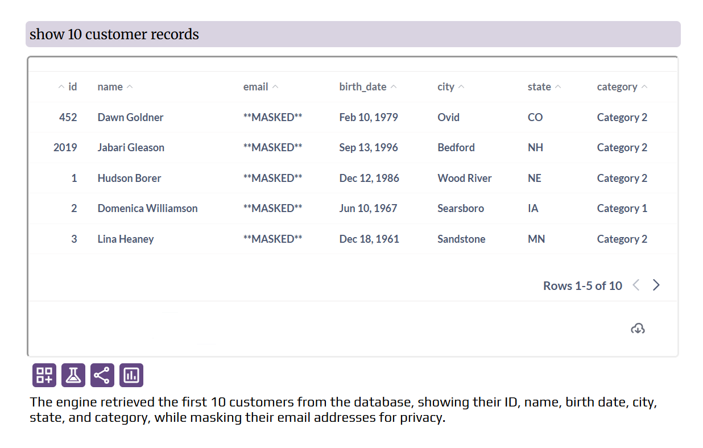

# Admin Panel Overview

<!-- ### App Mode

DataBot has two modes:

- **Schema Mode**: In this mode, only the database schema (table/view names, column names, and column types) is provided to the LLM as context. You can control what to share at the database level, table/view level, and row level for different user groups. The chatbot responses in this mode are Metabase cards containing data or visualizations.

- **Analytical Mode** (Default): In this mode, relevant data from the database is provided to the LLM as context*. You can control what to share at the database level, table/view level, and row level for different user groups. You can also specify certain dashboards to be used as data sources for answering user questions (in addition to database tables/views). The chatbot responses in this mode are textual or visual, depending on the query. *This mode is more flexible and allows users to perform a broader range of tasks than in Schema Mode*. You can think of it as ChatGPT with access to domain-specific knowledge from your database, dashboards, or manually provided metadata.

* OpenAI does NOT use the data sent through their API for training their models. By default, they retain data for 30 days for abuse monitoring purposes. You can apply for zero data retention. -->

### LLM Config

Here you set your OpenAI API key. Your OpenAI account needs to be at least on <a href="https://platform.openai.com/docs/guides/rate-limits/usage-tiers#usage_tiers" target="_blank">tier 1</a>, as DataBot uses some features that are not available in the free tier models. Tier 3+ is recommended for production use.

Here you can also configure several features for LLM. One important feature is **web search**. When web search is enabled, user queries that cannot be answered by database data, would be answered by web search.

### BI Integration

!!! note

    Currently only **Metabase** is supported for BI integration. We are planning to add support for other BI tools such as **Apache Superset** and **Redash** in the near future.

Connecting DataBot to your BI tool allows you to

- Use the database connections defined in your BI tool for DataBot (instead of manually adding a database connection)
- Use the dashboards created in your BI tool as a data source for answering questions in DataBot
- Use the 'Dashboards + Chatbot' layout (explained below)

In the 'Dashboards + Chatbot' layout, after user login, the chatbot is shown on the right and a dashboard is shown on the left (plus a dashboard picker for selecting different dashboards). This format is ideal for **customer-facing analytics**, e.g. if you are already sharing one or more dashboards with your customers.

!!! note

    If there is extra empty space between the dashboards and the dashboard picker, you can set the environment variable `ADD_MARGIN_TOP_TO_DASHBOARD` to false at deployment time to remove the extra space.

In this subsection you can specify which dashboards should be available to each user group.

- Enable static embedding in your Metabase (Admin Panel > Settings > Embedding)
- For each dashboard ID assigned to user groups, enable embedding for it in Metabase (Top-right section of dashboard > Sharing > Embed > Static Embedding > Publish)

You can also associate user attributes with dashboard filters so the dashboards are automatically filtered (locked filters) using the user attribute value. You need to

- Enable "Auto-Filter Dashboards by User Attributes" in DataBot Admin Panel > BI Integration > 'Dashboards + Chatot Interface'
- Create a filter in your Metabase dashboard with the same name as the attribute.
- Tie the filter to relevant cards of the dashboard. 
- In [Top-right section of dashboard > Sharing > Embed > Static Embedding > Parameters] make the filter "Editable" and publish.

To enable this layout, add the parameter `show-chatbot-and-dashboards=true` to the URL. E.g. `https://mydomain.com/?show-chatbot-and-dashboards=true`.

Note that the position of the divider between the chatbot and dashboards is adjustable.

### Database Connections

This is where you connect your database(s), manage table-level permissions for each database, and can provide descriptions for databases, tables and columns.

### App Access Management

- **New Users Must be Granted Access Manually**: If this settings is disabled, when a user creates an account and verify their email, they can login to the app.
If this settings is enabled, when a user creates an account and verify their email, they still cannot login to the app until an admin grants them access manually in Admin Panel > User Management.
- **Only Certain Email Domains Can Create an Account**: If this setting is enabled, only the email domains that you specify can create an account. This would only affect the new signups.

### User Management

- **User Groups**:
You can create user groups and view the list of members for each group. There are two built-in groups: "Admins" and "Default".
    - When users sign up, they are automatically assigned to the "Default" group.
    - You can promote a user to admin by adding them to the "Admins" group.
- **User Group Assignment and Access Management**
You can grant or revoke access to the app for each user and assign groups to them. In DataBot, groups are used to manage table-level access; Users are assigned to groups, and groups are granted access to tables.
- **Custom User Attributes**
You can create custom user attributes. These attributes can be used in the following two ways to make sure users see only what they are supposed to see:
    - For defining row-level access control
    - For auto-filtering dashboards in "Dashboards + Chatbot Layout". These filters would be "locked" filters, meaning the users would not be able to see or change these filters.

### Email Setup

The email setup is required for email user sign-up and password-reset functionality.

### Default Language for All Users

You can set the default language which would apply to new users. Each user can set their own language preference in Settings > Language. The language would affect voice transcription, chatbot responses, and action buttons.

### Query Suggestions

<figure markdown="1">
{ width="600" }
</figure>

In this section, you can define sample queries to be displayed on the homepage. This will greatly help new users understand the types of questions they can ask.

### Performance Tuning

In this section, you have the option to choose different LLM models for different tasks. Although this is rarely necessary as the default values should work the best in most cases.

If the schema that is sent to LLM is very big (you can use the `db schema command` to see the schema) and the response quality is affected, you can try enabling **Schema Pruning** in this section.

### Compliance
If some of you clients require that their chats don't be stored in the database, you can provide their email domain in this tab.

### Text-to-SQL Translation Tests

<figure markdown="1">
{ width="600" }
</figure>

In this section, you can define test cases along with their expected SQL queries. You can then run these tests to verify if they all pass. If a test fails, you can see the reason for the failure. Sometimes the order of columns is different and it's in fact a false negative. If there are true failed cases, you can try one or more of the following changes and re-run the tests until all tests pass:

- Modifying the metadata (descriptions of the database, tables, and fields) (Admin Panel > Database Connections > [DB] > Manage Metadata)
- Choosing a different LLM model (Admin Panel > Performance Tuning)
- Enabling schema pruning (Admin Panel > Performance Tuning)

### Row-level Security (RLS)

While the Database Connections tab manages table-level access for user groups, this section allows you to manage row-level access for user groups.

### Data Obfuscation

You can specify which columns' data should be obfuscated for each user group. Obfuscation is done using dynamic data masking. In other words, the mask is dynamically applied on the specified column(s) without the need to hard-code it in your database.

### White-Labeling

In this section you can replace the DataBot name and logo, and provide your own demo link (which will be shown to new users).

The configurations in this section will take effect only if white-labeling is enabled in your license key.

### Misc.

- **Send Errors to the DataBot Cloud Server for Analysis**
This helps us better assist you in the event of an application error. It also allows us to take a proactive approach and release patches in a timely manner.
- **Send anonymized usage data to the DataBot cloud server to help improve DataBot**
Anonymizing converts a value like 'support@staging.intellimenta.com' to 'e86477008dc34c19b50d9aad9fe12d935db2d1289edd2cbc'. Collecting anonymized data helps us improve DataBot.

