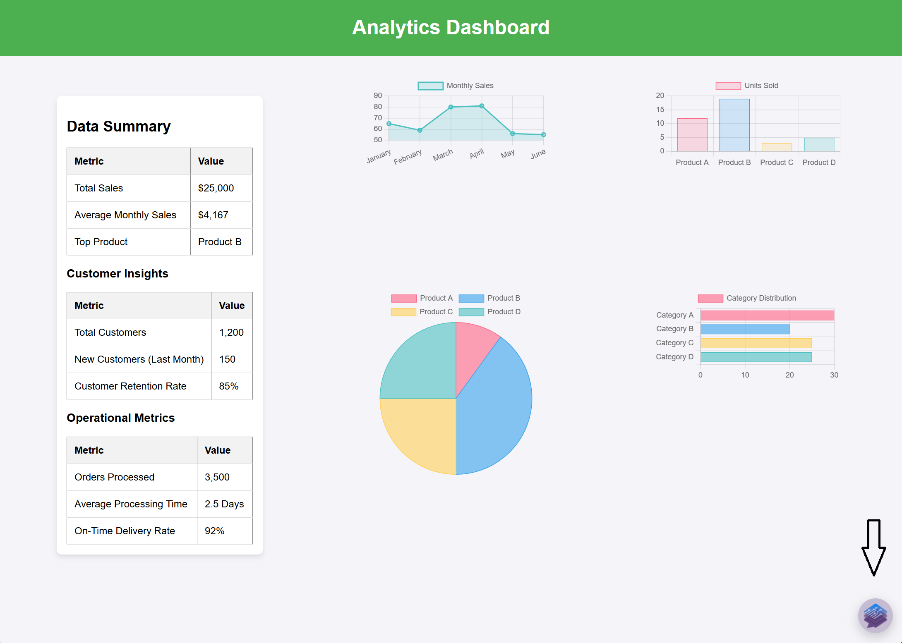
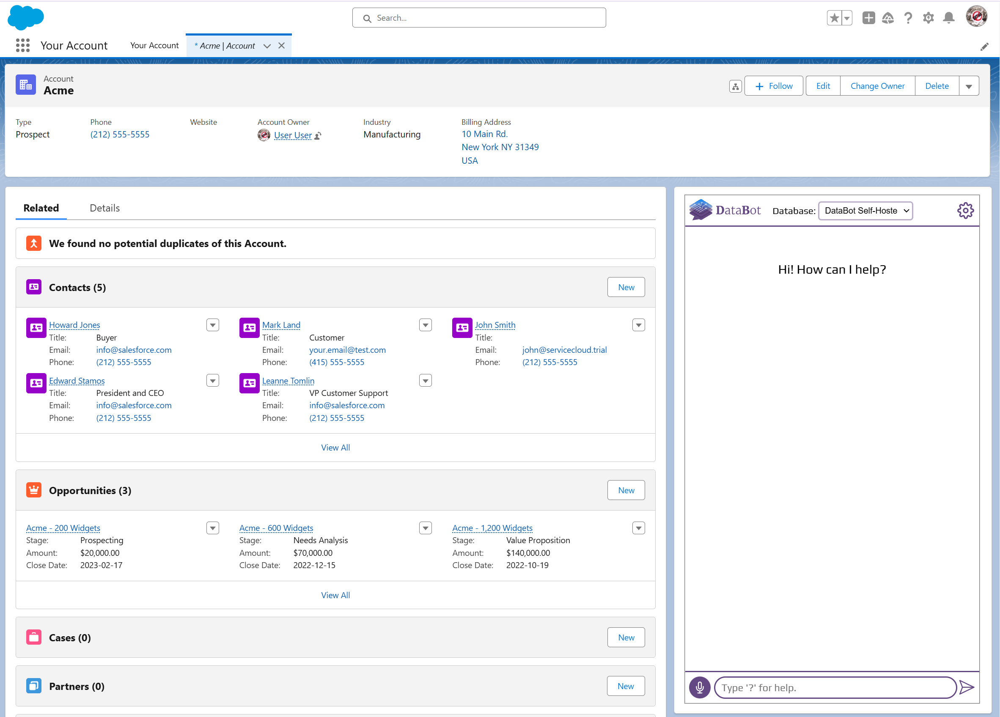

# Embedding 

In addition to using DataBot in a dedicated webpage—either with just the chatbot or [with both the chatbot and dashboards](./admin_panel_overview.md#bi-integration)—you can also embed it directly into your own website or application, as follows:

### Embedding as a Widget
If you control the platform where you want to place DataBot, adding it as a widget is the most seamless option. It delivers a native feel and integrates directly with your environment.

- Download `datbot-widget.js` from [here](http://intellimenta.com/files/databot-widget.js).
- Optionally modify it by changing colors, etc.
- Include the following code snippet in the frontend of your app or website.

```html
<script
  src="databot-widget.js"
  defer
  databot-url="[DATABOT URL]/?is-widget=true"
></script>
```



### Embedding as an iframe
If you do not control the platform where you want to place DataBot, such as a CRM or third party tool, embedding it as an iframe is the simplest way to integrate DataBot within that tool.

```html
<iframe src="[DATABOT URL]" allow="microphone"></iframe>
```

### Single Sign-On (SSO)
Whether you embed DataBot as a widget or an iframe, SSO lets you authenticate users through your existing identity provider. This removes the need for a separate DataBot login and creates a smooth experience.

You can control user access levels by specifying the `group_memberships` and `custom_user_attribute_assignments` parameters.

- `group_memberships` defines which tables or views a user can access.
- `custom_user_attribute_assignments` is used to manage access at row level and also for dashboard cards—both when viewing dashboards and when using dashboard cards as data source.

From your backend, send a request to /sso-auth to receive an *encoded user session ID* (EUSI):

```py
import jwt
import time
import requests

base_url = 'http...'  # the databot url. E.g., "http://localhost:5000"  
DATABOT_AUTH_KEY = ***  # this is the environment variable you provided 
                        # when deploying DataBot

# Generate JWT token
jwt_payload = {
    "email": "user@example.com",  # replace with the actual user email
    "iat": int(time.time()),
    "exp": int(time.time()) + 10,  # expires in 10 seconds
    
    # optional
    "group_memberships": ['group1', 'group2'],  # example values
    "custom_user_attribute_assignments": {  
        "attr1": "12345",  # example key-value 
        "attr2": "abcd",  # example key-value
    }
}

try:
    # Sign the JWT using HS256
    jwt_token = jwt.encode(jwt_payload, DATABOT_AUTH_KEY, algorithm="HS256")

    # Place token in Authorization header
    headers = {
        "Authorization": f"Bearer {jwt_token}",
        "Content-Type": "application/json"
    }

    response = requests.post(f"{base_url}/sso-auth", headers=headers)
    print(response.json())  
    # {'eusi': 'eyJhbGciOiJIUzI1NiI...'}
except Exception:
    print(response.text)
    # in production, add alerts to be notified about the error
```

You would then use the EUSI to build the iframe URL:

```html
<!-- Replace [EUSI] with the actual session ID -->
<iframe src="https://your-databot-url/?eusi=[EUSI]" allow="microphone"></iframe>

<!-- Example -->
<iframe src="https://your-databot-url/?eusi=eyJhbGci..." allow="microphone"></iframe>
```

You can use the environment variable `SSO_SESSION_TIMEOUT_SECONDS` to specify how many seconds the iframe URL should remain valid. The default is 15 seconds, based on the assumption that your backend generates a new EUSI on each page load.

### Embedding in Salesforce

The easiest way to embed DataBot as an iframe inside Salesforce is using a Visualforce Page:
```html
<apex:page showHeader="false" applyBodyTag="false" applyHtmlTag="false">
    <iframe 
        src="[iframe url]" 
        width="99%" 
        height="800" 
        allow="microphone"
        style="border: 1.5px groove #ccc;">
    </iframe>
</apex:page>
```


