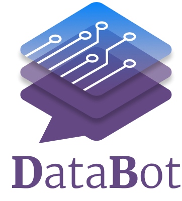

<figure markdown="1">
{ width="150" }
</figure>

<a href="https://intellimenta.com/products/databot" target="_blank">DataBot</a> is a Generative BI chatbot that enables users to ask data-related questions, request analysis, create visualizations, generate forecasts and more, all using natural language (in their native language).

DataBot is **self-hosted** and **free** for personal use. Trying out DataBot is super easy. To get started, click [here](./admin_guide/getting_started.md).

## Watch DataBot in Action

<iframe src="https://www.loom.com/embed/d3746a993eca463eb5100ce65104cfb6?sid=24bdcfd1-233a-4d60-82ab-85eaa879f78e" frameborder="0" webkitallowfullscreen mozallowfullscreen allowfullscreen style="position: absolute; top: 0; left: 0; width: 100%; height: 100%;"></iframe>

